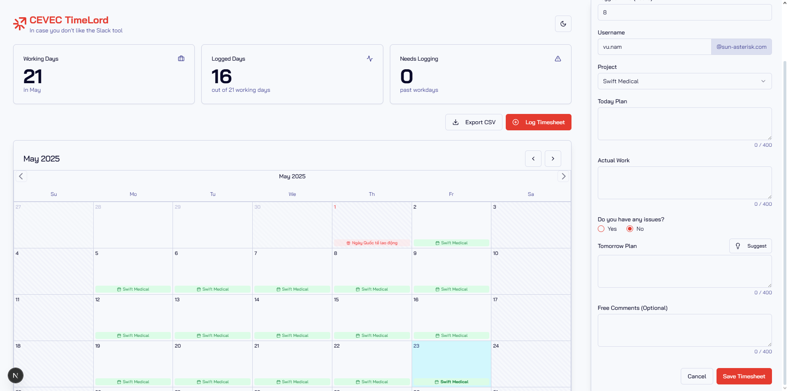

# CEVEC TimeLord

CEVEC TimeLord is a tool I created for my own purpose for monthly work logging time with Sun* CEVEC. This was totally not made out of frustration with the current implementation (Slack form + Google Sheet), but also a study project for me to learn how to create structured schemas, integration with external db (`NeonDB`) and ORM (`Kesely`), external public API (`nager.date`) for fetching list of public holidays, CSV export with sanitization, AI integration (using `Firebase Genkit`)



## Key Features

*   **Comprehensive Daily Logging:** Log your daily tasks including what you planned, what you actually accomplished, any issues encountered, and your plan for the next day.
*   **Interactive Calendar View:** Visualize your logged days, total working days in the month, and days that still require timesheet entries.
*   **Vietnam Public Holiday Integration:** Automatically displays public holidays for Vietnam directly on the calendar.
*   **AI-Powered Planning Assistance:** Leverages Genkit and Google AI to provide intelligent suggestions for "Tomorrow's Plan," with a focus on UI/UX related tasks.
*   **CSV Data Export:** Easily export your timesheet data to a CSV file for reporting or archiving.
*   **Monthly Statistics:** Get a quick overview of your logged days versus the total working days for the current month.
*   **Dark Mode Support:** Switch between light and dark themes for comfortable viewing.

## Technology Stack

*   **Frontend:** Next.js (v15+ with Turbopack), React, TypeScript
*   **UI Components:** Radix UI (for accessible components like Dialogs, Popovers, etc.)
*   **Styling:** Tailwind CSS
*   **Icons:** Lucide Icons
*   **Forms & Validation:** React Hook Form, Zod
*   **AI Integration:** Genkit (with `@genkit-ai/googleai` for Google AI models)
*   **Backend API:** Next.js API Routes
*   **Database:** PostgreSQL
*   **ORM:** Kysely (for type-safe SQL query building)
*   **Date Utilities:** date-fns

## Deployment Options

### Option 1: Docker Deployment (Recommended)

The application can be deployed using Docker and Docker Compose, which provides an isolated and consistent environment.

#### Prerequisites
- Docker and Docker Compose installed on your system
- A Google API key for Gemini AI features

#### Steps to Deploy with Docker

1. **Clone the repository:**
   ```bash
   git clone https://github.com/vnt87/cevectime.git
   cd cevectime
   ```

2. **Create a .env file for Docker Compose:**
   ```bash
   cp .env.example .env
   ```
   Update the .env file with your Google API key:
   ```
   GOOGLE_API_KEY=your_gemini_api_key_here
   ```

3. **Start the application:**
   ```bash
   docker-compose up -d
   ```
   This will:
   - Start a PostgreSQL database
   - Build and start the application
   - Run necessary database migrations
   
   The application will be available at `http://localhost:3000`

4. **View logs (optional):**
   ```bash
   docker-compose logs -f app  # View application logs
   docker-compose logs -f db   # View database logs
   ```

5. **Stop the application:**
   ```bash
   docker-compose down
   ```
   To also remove the database volume:
   ```bash
   docker-compose down -v
   ```

### Option 2: Local Development Setup

Follow these steps to get the CEVEC Timesheet Logger running on your local machine.

[... rest of the original README content ...]

## Available Scripts

[... existing scripts section ...]

## Production Deployment Notes

For production deployment using Docker:

1. **Environment Variables:**
   - Set up the necessary environment variables in your production environment
   - Required variables:
     - `GOOGLE_API_KEY`: For AI features
     - Database variables are pre-configured in docker-compose.yml

2. **Database Backups:**
   - The PostgreSQL data is persisted in a Docker volume named `cevectime-pgdata`
   - Implement regular backups of this volume in production

3. **Updating the Application:**
   ```bash
   # Pull the latest image
   docker-compose pull
   
   # Restart the services with the new image
   docker-compose up -d
   ```

4. **Health Checks:**
   - The application container depends on database availability
   - Database health is checked before the application starts
   - Monitor the application status using Docker health checks
